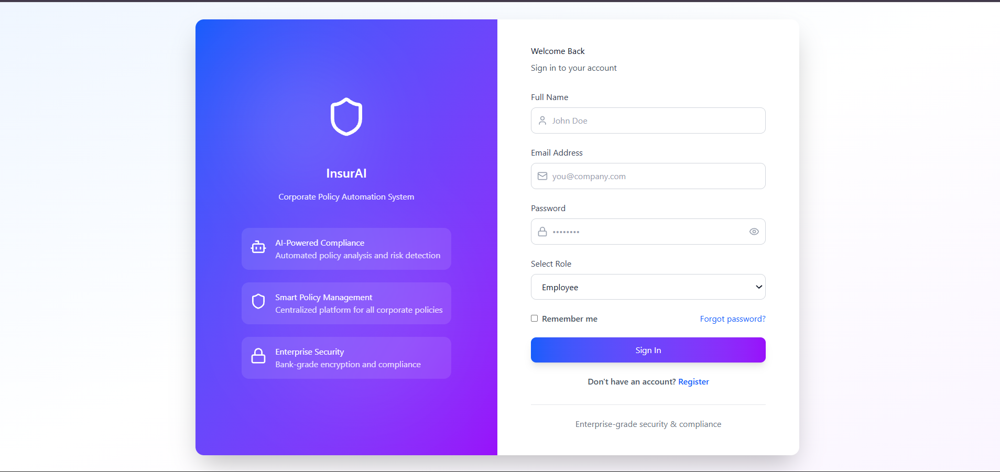
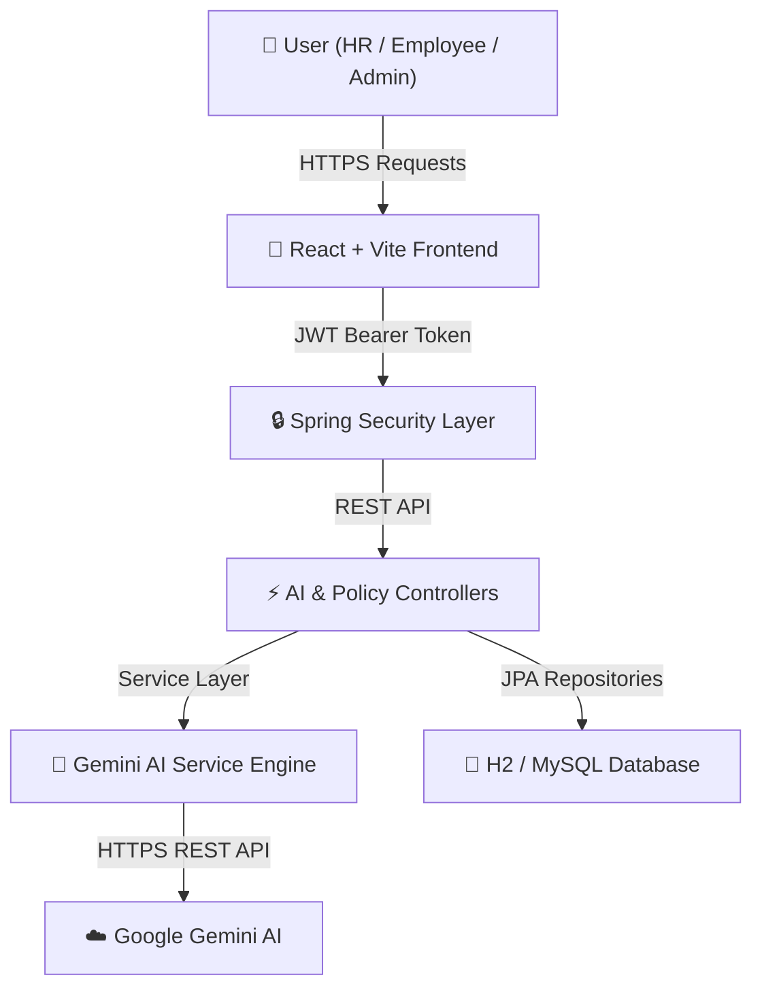

<div align="center">

# 🛡️ InsurAI — Corporate Policy Automation & AI Intelligence System

[](https://insur-ai-project-peach.vercel.app)
[](https://github.com/Dharnishkumaran0831/InsurAI-Project)
[](https://spring.io/projects/spring-boot)
[](https://reactjs.org/)
[](https://www.typescriptlang.org/)
[](https://aistudio.google.com/)

<p align="center">
  <b>An enterprise-grade full-stack insurance automation platform powered by Google Gemini AI, Spring Boot, and React.</b>
  <br />
  Automates policy recommendations, document compliance audits, employee benefit verification, and claims processing.
</p>

[🌐 Visit Live Website](https://insur-ai-project-peach.vercel.app) • [📖 Explore API Docs](#-api-endpoints-reference) • [🚀 Quick Start](#-getting-started)

</div>

---

## 📸 Screenshots Showcase

<div align="center">

### 🔐 Authentication & Enterprise Dashboard Interface

*Figure 1: InsurAI Role-Based Portal featuring JWT Security, AI Compliance Scanner, and Policy Management.*

</div>

---

## 🎯 Executive Overview & Problem Statement

Traditional corporate insurance workflows suffer from heavy documentation overhead, manual verification delays, policy mismatching, and compliance oversight risks. 

**InsurAI** modernizes corporate insurance ecosystems by integrating **Google Gemini AI** with a secure Spring Boot microservices backend and a dynamic React frontend.

### Key Value Propositions:
- ⚡ **Instant AI Policy Recommendation:** Personalizes corporate health, travel, equipment, and life policies in seconds.
- 🛡️ **Automated Compliance Auditing:** Scans contracts for legal risks, missing clauses, and liability issues with real-time scoring.
- 🤖 **Interactive AI Assistant:** Answers HR policy questions and employee benefit queries 24/7.
- 🔒 **Bank-Grade Security:** JWT-based authentication, role-based authorization (HR, Admin, Employee), and server-side secret management.

---

## 🧠 Integrated Google Gemini AI Features

| Feature | Endpoint | Description |
| :--- | :--- | :--- |
| **🤖 AI Policy Recommendation Engine** | `POST /api/ai/policy-recommendation` | Analyzes employee department, employment type, and coverage needs to recommend optimal insurance plans. |
| **🛡️ AI Compliance Checker** | `POST /api/ai/compliance-check` | Scans policy documents for high-risk conditions and missing legal clauses while saving audit logs to database. |
| **💬 AI Policy Assistant** | `POST /api/ai/query` | Natural language QA engine for HR policy guidance and employee benefit inquiries. |

> [!IMPORTANT]
> **Zero Key Exposure:** The Google Gemini API key (`GEMINI_API_KEY`) is stored exclusively on the Spring Boot backend server. No API keys are exposed to client-side browser bundles or committed to source control.

---

## 🏗️ System Architecture & Workflow



---

## 🛠️ Technology Stack

### Frontend Architecture
- **Framework:** React 18 + Vite
- **Language:** TypeScript
- **Styling:** Tailwind CSS + Lucide Icons
- **HTTP Client:** Axios / Fetch API
- **Notifications:** Sonner Toast Notifications

### Backend Architecture
- **Framework:** Java 17+ / Spring Boot 3.5
- **Security:** Spring Security + JWT Authentication
- **Data Persistence:** Spring Data JPA / Hibernate
- **Database:** H2 In-Memory (Dev) / MySQL 8.0 (Prod)
- **Build Tool:** Apache Maven

---

## 📖 API Endpoints Reference

### 🔐 Authentication Controller (`/api/auth`)
- `POST /api/auth/register` — Register new user account.
- `POST /api/auth/login` — Authenticate and receive JWT Bearer token.

### 🤖 AI Controller (`/api/ai`)
- `POST /api/ai/policy-recommendation` — Generate AI policy recommendations.
- `POST /api/ai/compliance-check` — Analyze document compliance and log audit.
- `POST /api/ai/query` — Ask Gemini AI Assistant policy questions.
- `GET /api/ai/audit-history?email={email}` — Retrieve historical compliance audit logs.

---

## 🚀 Getting Started

### Prerequisites
- **Node.js:** `v18.0.0` or higher
- **Java Development Kit (JDK):** `17` or higher
- **Maven:** `3.8+` (or use `./mvnw` wrapper)

### 1. Run Backend Server
```bash
cd backend
./mvnw spring-boot:run
```
> The backend server starts automatically at `http://localhost:8080`.

### 2. Run Frontend Client
```bash
cd frontend
npm install
npm run dev
```
> The frontend client starts automatically at `http://localhost:5173`.

---

## 🌐 Deployment Configuration

- **Frontend Deployment (Vercel):** Pre-configured with [`vercel.json`](file:///d:/InsurAI-Project-main/InsurAI-Project-main/vercel.json)
- **Full-Stack Deployment (Render):** Pre-configured with [`render.yaml`](file:///d:/InsurAI-Project-main/InsurAI-Project-main/render.yaml)

Live Web App: **[https://insur-ai-project-peach.vercel.app](https://insur-ai-project-peach.vercel.app)**

---

## 👨‍💻 Developer & Contributions

Developed with ❤️ by **Dharnishkumaran** and contributors.

- **Lead Developer:** [Dharnishkumaran0831](https://github.com/Dharnishkumaran0831)
- **Repository:** [Dharnishkumaran0831/InsurAI-Project](https://github.com/Dharnishkumaran0831/InsurAI-Project)

### 🤝 How to Contribute
1. Fork the repository
2. Create a feature branch (`git checkout -b feature/AmazingFeature`)
3. Commit your changes (`git commit -m 'Add some AmazingFeature'`)
4. Push to the branch (`git push origin feature/AmazingFeature`)
5. Open a Pull Request

---

<div align="center">

⭐ **If you find InsurAI useful, please give the repository a star on GitHub!** ⭐

</div>
